# Atelier Architecture Overview

This document provides a comprehensive technical overview of Atelier - AI Creative Design Studio, covering system architecture, data flows, integration patterns, and deployment specifications for developers and platform architects.

## System Architecture

Atelier operates as a containerized MCP (Model Context Protocol) plugin within the Nexus ecosystem, leveraging distributed AI infrastructure for scalable image generation and creative asset production.

### High-Level Architecture

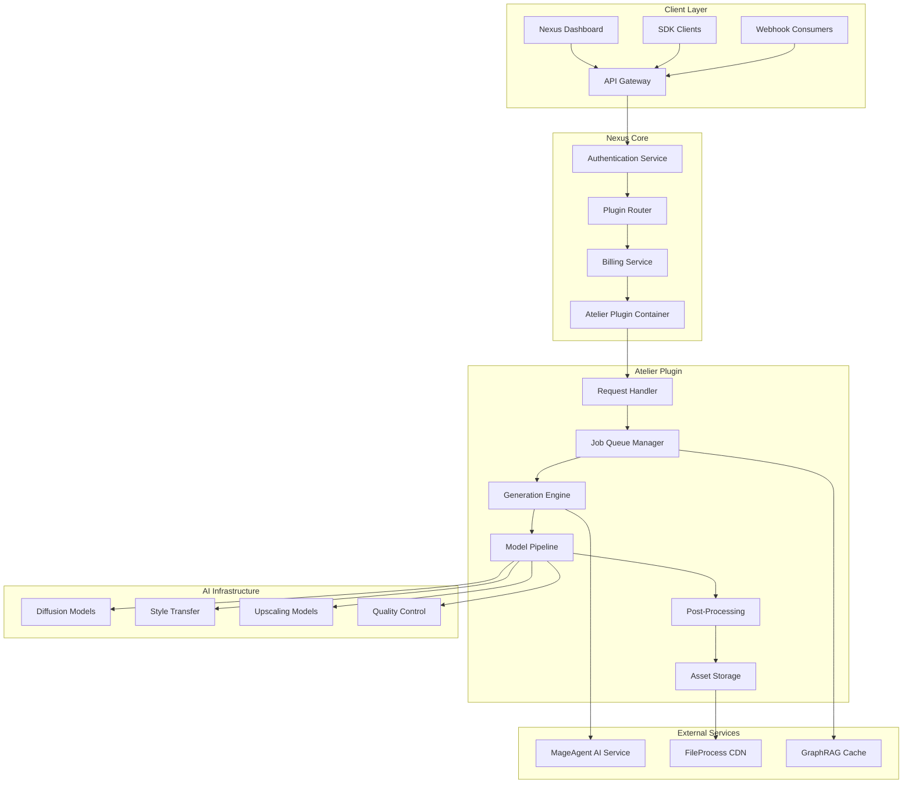

## Component Architecture

### Request Handler

The request handler validates incoming API calls, enforces rate limits, and routes requests to appropriate processing pipelines.

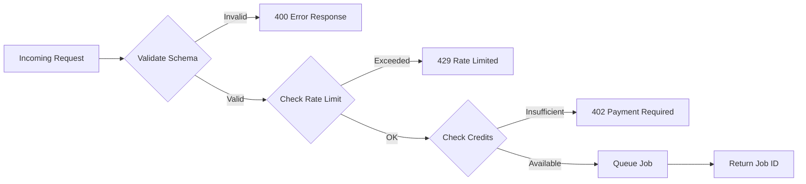

**Request Validation Pipeline:**

| Stage | Function | Timeout |
|-------|----------|---------|
| Schema Validation | JSON schema compliance | 50ms |
| Authentication | JWT/API key verification | 100ms |
| Rate Limiting | Token bucket algorithm | 20ms |
| Credit Check | Real-time balance query | 150ms |
| Job Creation | Queue insertion | 100ms |

### Job Queue Manager

Atelier uses a priority-based job queue with tier-aware scheduling to ensure fair resource allocation while providing premium users with faster processing.

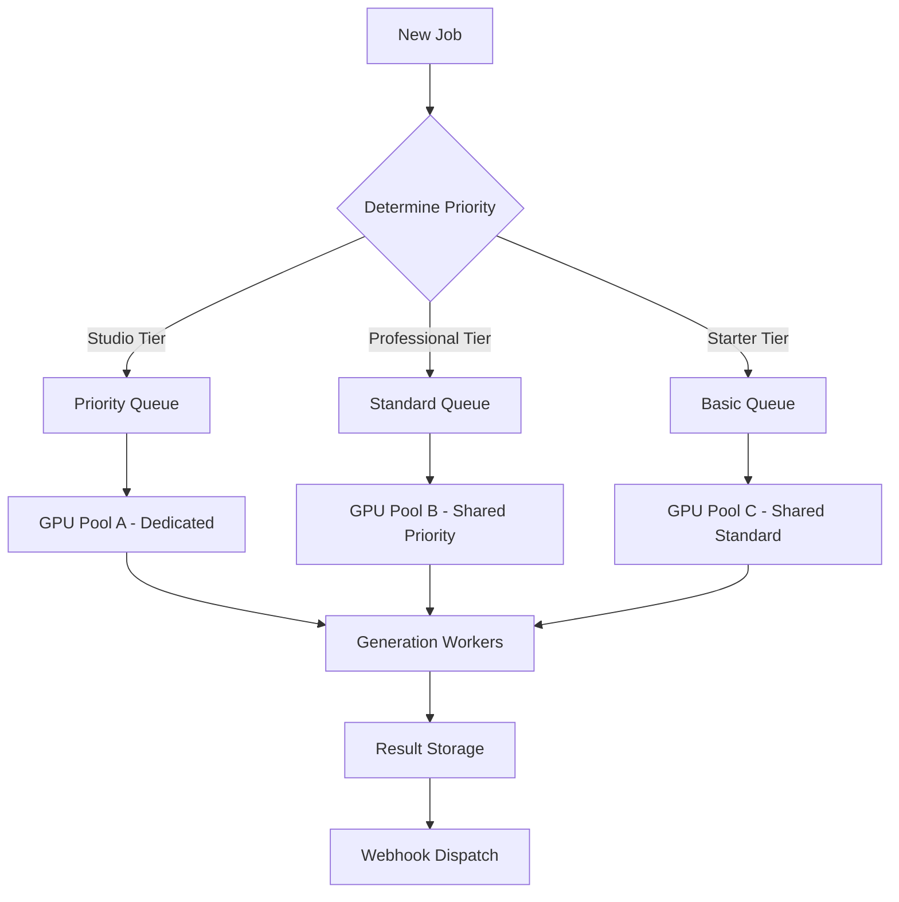

**Queue Configuration:**

```yaml
queues:
  priority:
    maxConcurrent: 10
    maxWaitTime: 30s
    gpuAllocation: dedicated
  standard:
    maxConcurrent: 50
    maxWaitTime: 120s
    gpuAllocation: shared-priority
  basic:
    maxConcurrent: 100
    maxWaitTime: 300s
    gpuAllocation: shared-standard
```

### Generation Engine

The generation engine orchestrates multiple AI models to produce final outputs based on request parameters.

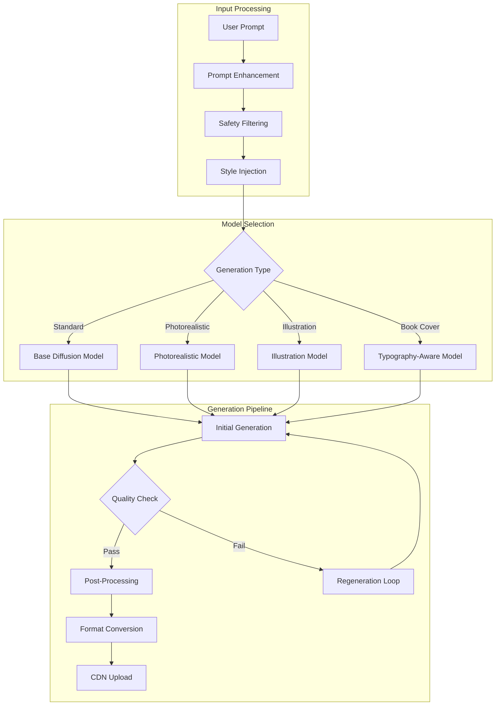

### Model Pipeline Details

Atelier employs a multi-stage model pipeline optimized for different creative outputs:

**Stage 1: Prompt Processing**
- Semantic analysis and enhancement
- Brand guideline injection
- Safety content filtering
- Style parameter extraction

**Stage 2: Core Generation**
- Latent diffusion processing
- Attention mechanism optimization
- Conditional generation based on parameters
- Multi-step denoising (20-50 steps based on quality setting)

**Stage 3: Refinement**
- Face correction for human subjects
- Detail enhancement pass
- Color correction and grading
- Artifact removal

**Stage 4: Output Processing**
- Resolution upscaling (up to 8K)
- Format conversion (PNG, JPEG, WebP, SVG)
- Metadata embedding
- Compression optimization

## Data Flow Architecture

### Generation Request Flow

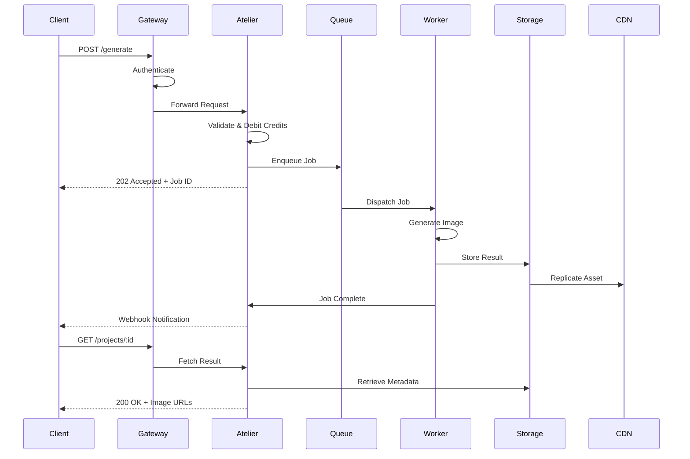

### Asset Storage Architecture

Generated assets flow through a tiered storage system optimized for different access patterns:

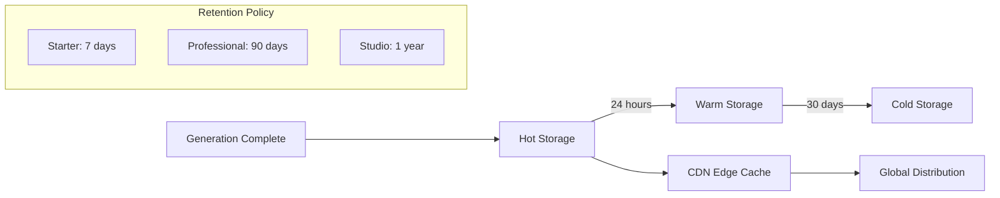

**Storage Specifications:**

| Tier | Storage Type | Access Latency | Cost |
|------|--------------|----------------|------|
| Hot | NVMe SSD | <10ms | High |
| Warm | SSD | <100ms | Medium |
| Cold | Object Storage | <1s | Low |
| Archive | Glacier-class | Minutes | Minimal |

## Integration Architecture

### Nexus Core Services Integration

Atelier integrates with core Nexus services for AI processing, caching, and file management:

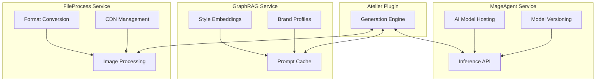

**Service Communication:**

| Service | Protocol | Port | Authentication |
|---------|----------|------|----------------|
| MageAgent | gRPC | 50051 | mTLS |
| GraphRAG | REST | 8080 | Service Token |
| FileProcess | REST | 8081 | Service Token |
| Billing | gRPC | 50052 | mTLS |

### Webhook Architecture

Atelier supports robust webhook delivery for asynchronous notification of generation events:

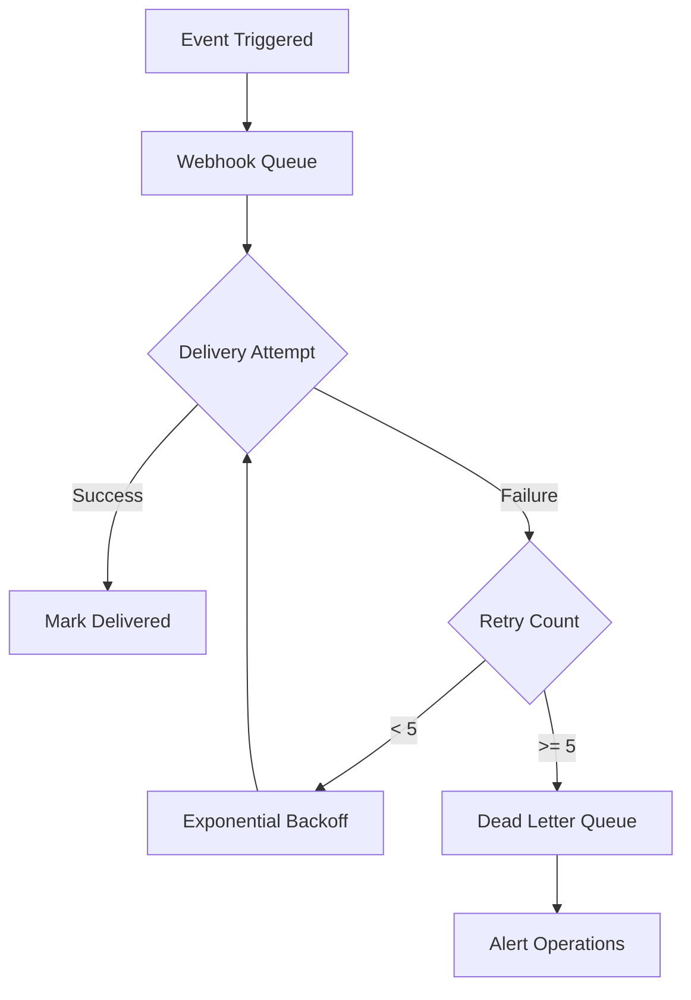

**Webhook Payload Example:**

```json
{
  "event": "generation.completed",
  "timestamp": "2025-01-15T14:32:18.547Z",
  "data": {
    "generationId": "gen_8f7a6b5c4d3e2f1a",
    "status": "completed",
    "images": [
      {
        "id": "img_1a2b3c4d5e6f",
        "url": "https://cdn.adverant.ai/atelier/gen_8f7a6b5c4d3e2f1a/output_001.png",
        "width": 1920,
        "height": 1080
      }
    ],
    "processingTimeMs": 28450,
    "creditsUsed": 1
  },
  "signature": "sha256=7f8a9b2c3d4e5f6a7b8c9d0e1f2a3b4c5d6e7f8a9b0c"
}
```

## Deployment Architecture

### Kubernetes Deployment

Atelier deploys as a containerized workload with horizontal pod autoscaling based on queue depth and GPU utilization:

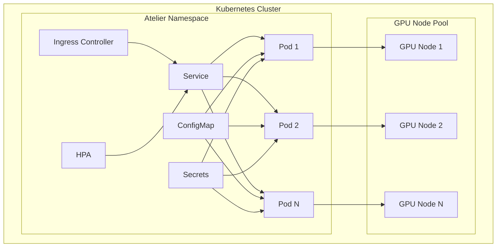

**Resource Specifications:**

```yaml
resources:
  requests:
    cpu: "2000m"
    memory: "4096Mi"
  limits:
    cpu: "4000m"
    memory: "8192Mi"
    nvidia.com/gpu: 1

autoscaling:
  minReplicas: 2
  maxReplicas: 20
  targetCPUUtilization: 70
  targetMemoryUtilization: 80
  scaleUpStabilization: 60s
  scaleDownStabilization: 300s
```

### High Availability Configuration

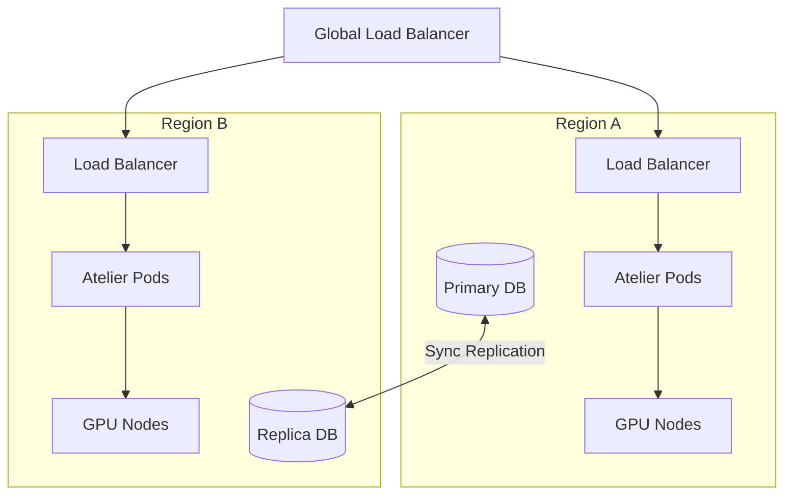

## Security Architecture

### Data Protection

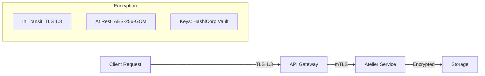

**Security Controls:**

| Layer | Control | Implementation |
|-------|---------|----------------|
| Network | Encryption | TLS 1.3 mandatory |
| Authentication | API Keys | SHA-256 hashed, rotatable |
| Authorization | RBAC | Workspace-scoped permissions |
| Data | Encryption | AES-256-GCM at rest |
| Audit | Logging | Immutable audit trail |
| Compliance | GDPR | Data residency options |

### Content Safety Pipeline

All generated content passes through multi-stage safety filtering:

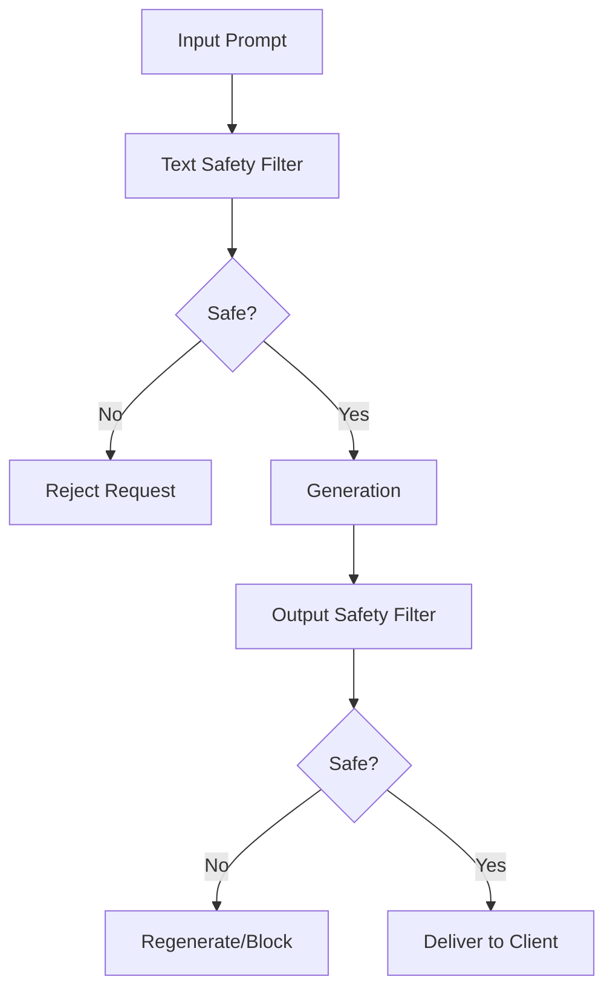

## Performance Specifications

### Latency Targets

| Operation | P50 | P95 | P99 |
|-----------|-----|-----|-----|
| API Response | 150ms | 300ms | 500ms |
| Standard Generation (1024px) | 15s | 25s | 35s |
| High Quality Generation (2048px) | 30s | 45s | 60s |
| Ultra Quality Generation (4096px) | 60s | 90s | 120s |
| Webhook Delivery | 500ms | 2s | 5s |

### Throughput Capacity

| Tier | Concurrent Jobs | Jobs/Hour | Peak Burst |
|------|-----------------|-----------|------------|
| Starter | 2 | 20 | 5 |
| Professional | 5 | 100 | 15 |
| Studio | 20 | Unlimited | 50 |

## Monitoring and Observability

### Metrics Collection

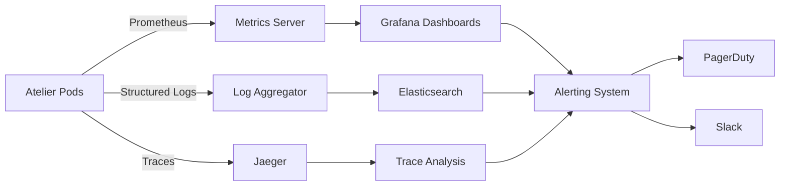

**Key Metrics Monitored:**

- Generation success rate
- Queue depth and wait times
- GPU utilization and temperature
- API latency percentiles
- Credit consumption rates
- Error rates by type

## API Specifications Summary

| Endpoint | Method | Timeout | Rate Limit |
|----------|--------|---------|------------|
| `/api/v1/atelier/generate` | POST | 600s | 10/min |
| `/api/v1/atelier/book-covers` | POST | 600s | 5/min |
| `/api/v1/atelier/characters` | POST | 600s | 5/min |
| `/api/v1/atelier/projects/:id` | GET | 30s | 60/min |

For complete API documentation, see [API Reference](docs/api-reference/endpoints.md).

## Further Reading

- [Quick Start Guide](QUICKSTART.md) - Get up and running quickly
- [Use Cases](USE-CASES.md) - Real-world implementation patterns
- [API Reference](docs/api-reference/endpoints.md) - Complete endpoint documentation
- [Security Whitepaper](docs/security/overview.md) - Detailed security architecture
